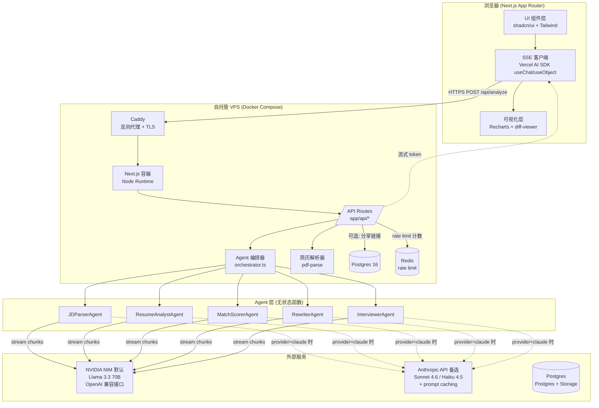
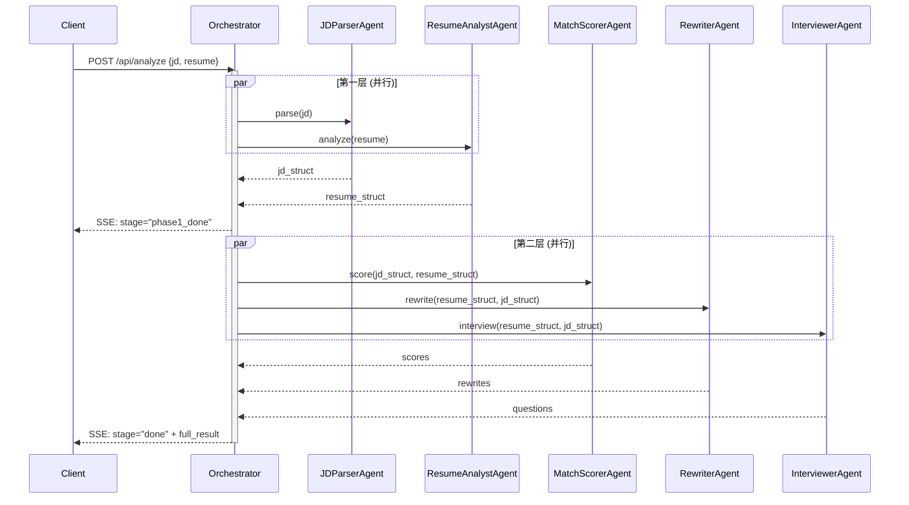

# JobLens · 系统架构设计

> 本文档描述 V1 的系统架构：模块划分、数据流、关键序列、技术选型理由。
> 配合 `docs/design.md`（产品蓝图）一起读。

---

## 一、架构总览



**核心原则：**
- **无状态 API**：每次分析请求是独立的，不依赖会话状态；只有"分享链接"功能才落库
- **Agent 即函数**：Agent 是纯函数 `(input, ctx) → AsyncIterable<chunk>`，不持有状态
- **流式优先**：从模型 → 编排器 → API → 浏览器，全链路流式，不做中间缓冲

---

## 二、分层职责

### 1. 客户端 (Next.js App Router · React Server Components)

| 子层 | 职责 | 关键文件 |
|---|---|---|
| 页面路由 | `/`、`/analyze`、`/result/[id]` 三个核心路由 | `app/(routes)/*` |
| UI 组件 | shadcn/ui 二次封装的设计系统 | `components/ui/*` |
| 流式接收 | 监听 SSE，把多路 Agent token 路由到对应面板 | `lib/client/stream.ts` |
| 可视化 | 雷达图、diff、热力图等纯展示组件 | `components/viz/*` |
| 状态管理 | Zustand（轻量）或纯 React state；不引入 Redux | `lib/client/store.ts` |

**为什么不用 Server Actions 做主流程？** Server Actions 不天然支持多路并行流式，自己拼麻烦；走 Route Handler + Vercel AI SDK `streamObject` 更直接。

### 2. API 层 (Edge Runtime 优先)

| 路由 | 方法 | 用途 |
|---|---|---|
| `/api/analyze` | POST | 主入口：接收 JD + 简历，返回多路流式 |
| `/api/upload` | POST | 简历 PDF 上传（multipart） |
| `/api/result/[id]` | GET | 加载已分享的结果 |
| `/api/result` | POST | 把当前结果固化为分享链接（写库） |

`/api/analyze` 跑 Node Runtime（因为 pdf-parse 需要 Node API）；其他可以跑 Edge。

### 3. Agent 编排器 (orchestrator.ts)

**编排策略：分层并行 (DAG)**



**为什么不用 LangGraph / CrewAI？**
- DAG 简单到 50 行代码搞定，引入框架反而增加心智负担
- 面试时要能逐行讲清编排逻辑，自写更可控
- Vercel AI SDK 已经处理了流式 + 工具调用 + JSON schema 三件最难的事

### 4. Agent 实现层

每个 Agent 是一个独立模块，形态高度一致：

```ts
// lib/agents/jd-parser.ts
export const JDParserAgent = {
  name: 'jd-parser',
  model: 'claude-haiku-4-5',
  inputSchema: z.object({ jd_text: z.string() }),
  outputSchema: JDStructSchema,  // 见 docs/schemas.md
  systemPrompt: '...',           // 长 prompt，启用 prompt caching
  run: async (input, ctx) => streamObject({...})
}
```

每个 Agent：
- 输入/输出有 Zod schema，编译期类型安全
- system prompt 走 prompt caching（每次调用省 70%+ token 成本）
- 失败自动重试 1 次（指数退避）；2 次仍失败则在 UI 上标红，但**不阻塞其他 Agent**
- 单 Agent 超时 30s 强制取消

### 5. 模型层 (双 Provider 抽象)

V1 同时接入两家 Provider，默认 Llama（零成本 demo），可一键切到 Claude（高质量对照）。

**Provider 抽象：**

```ts
// lib/providers/index.ts
export type ProviderName = 'llama' | 'claude'

export const providers = {
  llama: createOpenAICompatible({
    baseURL: 'https://integrate.api.nvidia.com/v1',
    apiKey: process.env.NVIDIA_API_KEY!,
    name: 'nvidia-nim',
  }),
  claude: createAnthropic({ apiKey: process.env.ANTHROPIC_API_KEY! }),
}

export const models = {
  llama: { default: 'meta/llama-3.3-70b-instruct' },
  claude: { light: 'claude-haiku-4-5', heavy: 'claude-sonnet-4-6' },
}
```

**Agent 端只声明"任务等级"，不绑定具体模型：**

```ts
const JDParserAgent = {
  tier: 'light',   // 'light' | 'heavy'
  ...
}
```

编排器根据当前 `PROVIDER` 环境变量解析为具体模型：

| Agent | Tier | Llama 模式 | Claude 模式 |
|---|---|---|---|
| JDParserAgent | light | llama-3.3-70b | haiku 4.5 |
| ResumeAnalystAgent | heavy | llama-3.3-70b | sonnet 4.6 |
| MatchScorerAgent | heavy | llama-3.3-70b | sonnet 4.6 |
| RewriterAgent | heavy | llama-3.3-70b | sonnet 4.6 |
| InterviewerAgent | heavy | llama-3.3-70b | sonnet 4.6 |

Llama 模式下所有 Agent 用同一模型（NIM 免费额度限制下最经济）；Claude 模式保留 Haiku/Sonnet 分级。

**Provider 切换方式（V1）：**
- 环境变量 `PROVIDER=llama`（默认）或 `claude`
- URL query 参数 `?provider=claude` 临时覆盖（用于面试现场对比展示）

**配置（NVIDIA NIM）：**
- Base URL：`https://integrate.api.nvidia.com/v1`
- Model：`meta/llama-3.3-70b-instruct`
- Temperature：0.3
- 走 OpenAI 兼容接口，使用 `@ai-sdk/openai-compatible`

**结构化输出策略：**
- Claude：用原生 tool use / `streamObject`，schema 合规率 99%+
- Llama (NIM)：用 `response_format: { type: "json_object" }` + 在 prompt 中强约束 + Zod 校验 + 失败重试 1 次。OpenAI-compatible JSON mode 在 NIM 上的稳定性需开发阶段实测，必要时降级为"prompt 内输出 JSON 块 + 正则提取"

**Prompt Caching 策略：**
- Claude 模式：system prompt + few-shot 走 prompt caching（>1024 tokens 命中），冷启 ~$0.04，命中 ~$0.012
- Llama (NIM) 模式：**不支持 caching**，但 NIM 免费额度内成本为 0；超额后转付费需另行评估

---

## 三、共享上下文对象 (AnalysisContext)

所有 Agent 共享一个结构化的上下文对象，**而不是把全部原文丢给每个 Agent**。这是设计的关键。

```ts
type AnalysisContext = {
  // 输入快照（不可变）
  input: {
    jd_text: string
    resume_text: string
    locale: 'zh' | 'en'
  }

  // 第一层产出
  jd_struct?: JDStruct          // 由 JDParserAgent 写入
  resume_struct?: ResumeStruct  // 由 ResumeAnalystAgent 写入

  // 第二层产出
  scores?: MatchScores
  rewrites?: Rewrite[]
  questions?: InterviewQuestion[]

  // 元信息
  trace_id: string
  started_at: number
  agent_timings: Record<string, { start: number; end?: number; status: 'pending'|'running'|'done'|'error' }>
}
```

每个 Agent 声明它**读**什么字段、**写**什么字段，编排器据此构建 DAG 并验证依赖。

---

## 四、流式协议

客户端 ↔ 服务端走 **SSE (Server-Sent Events)**，复用 Vercel AI SDK 的 `streamText` / `streamObject`。

**事件格式（自定义包装）：**

```
event: agent-start
data: { "agent": "jd-parser", "ts": 1234567 }

event: agent-chunk
data: { "agent": "jd-parser", "partial": { "hard_skills": ["Python"] } }

event: agent-done
data: { "agent": "jd-parser", "result": {...}, "duration_ms": 1820 }

event: stage-complete
data: { "stage": "phase1" }

event: error
data: { "agent": "rewriter", "code": "TIMEOUT", "message": "..." }

event: final
data: { "context": {...} }
```

客户端用一个 reducer 把这些事件聚合成完整 `AnalysisContext`，驱动 UI。

---

## 五、数据模型 (Postgres 16)

V1 只有"分享链接"一个写库场景，schema 极简：

```sql
create table shared_results (
  id          text primary key,           -- nanoid, URL 友好
  context     jsonb not null,             -- 完整 AnalysisContext 快照
  created_at  timestamptz default now(),
  expires_at  timestamptz default now() + interval '24 hours',
  view_count  int default 0
);

create index on shared_results (expires_at);
```

清理任务由 `cron` 容器每小时跑一次 SQL：

```sql
delete from shared_results where expires_at < now();
```

落实"24h 后删除"承诺。

**简历 PDF 不入库**：上传后只在内存里跑解析，解析完即丢；只有结构化后的文本（脱敏可控）才可能进 `shared_results`。

---

## 六、目录结构

```
joblens/
├── app/
│   ├── (routes)/
│   │   ├── page.tsx              # 落地页
│   │   ├── analyze/page.tsx      # 输入 + 分析中
│   │   └── result/[id]/page.tsx  # 结果页（分享链接）
│   └── api/
│       ├── analyze/route.ts
│       ├── upload/route.ts
│       └── result/[id]/route.ts
├── components/
│   ├── ui/                       # shadcn 基础组件
│   ├── viz/                      # 雷达图 / diff / 热力图
│   ├── agent-panel.tsx           # 分析中的单个 Agent 面板
│   └── result/                   # 结果页各 section
├── lib/
│   ├── agents/
│   │   ├── jd-parser.ts
│   │   ├── resume-analyst.ts
│   │   ├── match-scorer.ts
│   │   ├── rewriter.ts
│   │   ├── interviewer.ts
│   │   └── index.ts              # 注册表
│   ├── orchestrator.ts           # DAG 编排
│   ├── schemas.ts                # 所有 Zod schema
│   ├── prompts/                  # 每个 Agent 的 prompt 模板
│   ├── parse-resume.ts           # PDF/MD → text
│   ├── client/                   # 客户端工具
│   └── server/                   # 服务端工具（含 Postgres client）
├── fixtures/
│   ├── demo-resume.md
│   └── demo-jd.md
├── docs/
│   ├── design.md
│   ├── architecture.md           # ← 本文档
│   └── schemas.md                # 输出 schema 详表
└── ...
```

---

## 七、部署拓扑（自托管 · Docker Compose）

```
                 ┌─────────────────────────────────┐
                 │   joblens.xxx (自有域名)         │
                 │   ↓ DNS A 记录指向服务器 IP      │
                 └─────────────────────────────────┘
                                │
                                ▼
            ┌──────────────────────────────────────────┐
            │   单台 VPS (2C4G 起步, Linux + Docker)    │
            │   ┌────────────────────────────────────┐ │
            │   │  docker compose 网络                │ │
            │   │                                     │ │
            │   │  caddy ──TLS──► next ──┐            │ │
            │   │   :80/:443       :3000 │            │ │
            │   │                        ├──► postgres│ │
            │   │                        │     :5432  │ │
            │   │                        └──► redis   │ │
            │   │                              :6379  │ │
            │   │                                     │ │
            │   │  cron 容器 (清理过期 shared_results)  │ │
            │   └────────────────────────────────────┘ │
            └──────────────────────────────────────────┘
                  │                      │
                  ▼                      ▼
     ┌────────────────────┐  ┌──────────────────────┐
     │ NVIDIA NIM (默认)    │  │ Anthropic API 备选    │
     │ Llama 3.3 70B       │  │ Sonnet/Haiku          │
     │ OpenAI 兼容          │  │ + Prompt caching      │
     └────────────────────┘  └──────────────────────┘
```

**服务清单（docker-compose 中的 service）：**

| service | 镜像 | 端口 | 数据卷 | 作用 |
|---|---|---|---|---|
| `caddy` | `caddy:2-alpine` | 80, 443 | `caddy_data`, `caddy_config` | 反向代理 + 自动 Let's Encrypt 证书 |
| `next` | 项目自构建 (`Dockerfile`) | 3000 (内网) | — | Next.js 15 standalone 输出 |
| `postgres` | `postgres:16-alpine` | 5432 (内网) | `pg_data` | 存储 `shared_results` |
| `redis` | `redis:7-alpine` | 6379 (内网) | `redis_data` (可选) | Rate limit 计数 |
| `cron` | `postgres:16-alpine` (复用) 或 alpine + psql | — | — | 每小时清理过期分享记录 |

详细配置见 `docs/deployment.md`。

**为什么自托管而不是 Vercel？**
- **完全可控**：所有数据留在自有服务器，"简历内容不出境"是更硬的隐私承诺
- **零厂商绑定**：Next.js standalone 模式不依赖 Vercel 特有能力
- **成本可预测**：一台 2-4 美元/月的 VPS 就能跑，不会因流量爆发产生意外账单
- **可讲性**：面试时"我自己搭的 docker compose + Caddy + Postgres" 比"我部署到 Vercel" 多 10 分技术含量
- **trade-off**：失去 Preview Deployment、Edge Runtime、Vercel Analytics——这些用 PR 链接、Node Runtime、`next` 容器内日志即可替代

**Runtime 调整：**
- 所有 API 路由统一跑 **Node Runtime**（不再有 Edge / Node 混合）
- Next.js 用 `output: 'standalone'` 构建，最终镜像 < 200MB

**域名与 TLS：**
- DNS 用 Cloudflare（DNS-only，不开橙云，避免 SSE 长连接被截）
- 证书：Caddy 自动申请 Let's Encrypt，配置一行 `joblens.xxx { reverse_proxy next:3000 }`

---

## 八、性能 / 成本目标

| 指标 | 目标 |
|---|---|
| 冷启动首字节延迟 (TTFB) | < 800ms |
| 首个 Agent 开始流式输出 | < 1.5s |
| 全部 5 Agent 完成 | ≤ 15s (P50)，≤ 25s (P95) |
| 一次完整分析 API 成本 — Llama (NIM) 模式 | $0（免费额度内），超额后按 NIM 付费定价 |
| 一次完整分析 API 成本 — Claude 无缓存 | < $0.05 |
| 一次完整分析 API 成本 — Claude 缓存命中 | < $0.015 |
| VPS 月度费用 (2C4G, Demo 期) | ~$5 (Hetzner CX22 / Vultr / DigitalOcean basic) |
| 数据库/缓存 月度费用 | $0（容器内自托管 Postgres + Redis） |

---

## 九、可观测性

V1 不上专业 APM，但要有最小可见性：

| 数据 | 收集方式 | 用途 |
|---|---|---|
| 每个 Agent 的 duration / tokens / cost | 服务端 `pino` 结构化日志 → `docker logs` / 落盘 `/var/log/joblens/` | 调优 |
| 整体分析成功率 / 失败率 | 同上 | 监控 |
| 用户行为 (开始分析 / 完成 / 导出 / 分享) | 自埋点 → Postgres `events` 表（V2 再做） | 漏斗 |
| Prompt cache 命中率 | 从 Anthropic API 响应头读，记日志 | 验证成本估算 |
| 容器/主机指标 | `docker stats` + VPS 厂商自带监控 | 资源告警 |

V2 可以加 `dozzle` (容器日志 UI) 或上 OpenTelemetry → Grafana Cloud。

---

## 十、错误处理与降级

| 场景 | 处理 |
|---|---|
| 单个 Agent 超时 (>30s) | 取消该 Agent，UI 该面板标红"分析超时"，其他面板继续；最终结果页该 section 显示"本次未生成"，提供"重试该项"按钮 |
| 单个 Agent 输出 schema 校验失败 | 自动重试 1 次（强化 prompt 中的"必须输出 JSON"）；仍失败则降级为纯文本展示 |
| Anthropic API 全局不可用 | API 返回 503 + 友好文案；不熔断重试（避免雪崩） |
| PDF 解析失败 | 提示用户改为粘贴文本；保留"用示例简历"作为兜底 |
| 用户上传超大文件 (>5MB) | 客户端预检拦截 |
| Postgres 不可用 | 分享链接功能降级为"复制 JSON 到剪贴板"，主流程不受影响 |
| Redis 不可用 | Rate limit 降级为"内存计数"（仅当前 Node 进程，重启后清零），不阻塞主流程 |

---

## 十一、安全与隐私

| 维度 | 措施 |
|---|---|
| 简历内容传输 | HTTPS only；不写入服务端日志（结构化日志显式 redact `resume_text` 字段） |
| 简历内容存储 | 默认**不入库**；只有用户主动点"生成分享链接"才落 `shared_results` |
| 数据保留 | 分享链接 24h 自动过期 + 删除（Cron） |
| API 滥用防护 | IP-based rate limit (本地 Redis)：10 次/小时/IP |
| Prompt injection | 用户输入用明确分隔符包裹 (`<jd>...</jd>`)；system prompt 加防御指令；输出校验剔除可疑指令 |
| 第三方 (Anthropic) 隐私 | 首页明确告知"内容会发送给 Anthropic 用于推理，不会用于训练"（引用 Anthropic 政策） |
| 密钥管理 | `NVIDIA_API_KEY` / `ANTHROPIC_API_KEY` / Postgres keys 走 Vercel Env Vars；不进仓库 |

---

## 十二、依赖一览（V1 锁定版本）

| 类别 | 包 | 版本 |
|---|---|---|
| 框架 | next | ^15 |
| UI | react | ^19 |
| 样式 | tailwindcss | ^4 |
| 组件 | @radix-ui/* (via shadcn) | latest |
| AI SDK | ai (Vercel AI SDK) | ^4 |
| AI Provider (默认) | @ai-sdk/openai-compatible | latest |
| AI Provider (备选) | @ai-sdk/anthropic | latest |
| Schema | zod | ^3 |
| 状态 | zustand | ^5 |
| 可视化 | recharts | ^2 |
| Diff | react-diff-viewer-continued | latest |
| PDF | pdf-parse | latest |
| DB Client | postgres (porsager/postgres) | ^3 |
| Cache/RateLimit | ioredis | ^5 |
| ID | nanoid | ^5 |
| 工具 | clsx, tailwind-merge | latest |

---

## 十三、开放问题（待后续确认）

- [ ] 主色调最终敲定（冷蓝 vs 墨绿 vs 暖橙）
- [ ] 是否需要 i18n 框架（V1 只有中文，可能直接硬编码字符串）
- [ ] 是否做 Server-Side Rendering 缓存（落地页静态化 vs 动态）
- [ ] 简历 PDF 解析失败率高时是否引入 Claude 自身的 PDF 输入能力（API 直接读 PDF）
- [ ] VPS 厂商选型（Hetzner 性价比高但需海外卡 / 国内厂商需备案）
- [ ] CI/CD 方案：GitHub Actions push → 服务器 `git pull && docker compose up -d --build` 即可，是否上 Watchtower 自动拉镜像
- [ ] 镜像仓库：直接服务器本地构建 vs 推到 GHCR
- [ ] 备份策略：postgres `pg_dump` 每日 cron + 异地存储
